<h1 align="center">
  
  SoundView
</h1>

  <b>영상 속 들리지 않던 소리가</b> 
  <b>읽을 수 있는 자막과 느낄 수 있는 진동이 되는 곳</b>

 

  AI가 영상의 음성·감정·배경음을 분석하고 
  <b>AI 자막과 햅틱 피드백을 결합한 접근성 비디오 서비스</b>

 

  
  
  
  

 

  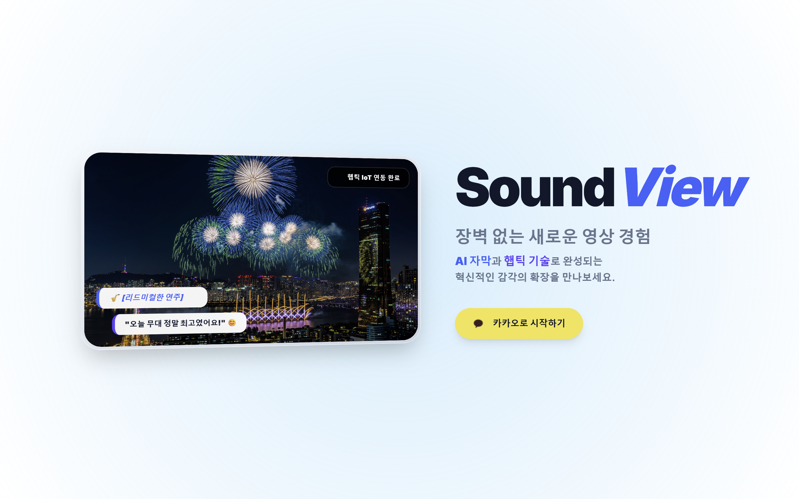

## 💡 기획 배경

기존 영상 플랫폼은 음성을 자막으로 보조하는 데 초점이 맞춰져 있어, 청각장애인 사용자가 배경음·효과음·감정 변화처럼 영상 몰입에 중요한 소리 정보를 충분히 경험하기 어렵습니다.

SoundView는 영상 속 음성을 텍스트로 변환하는 것을 넘어, AI가 감정과 배경음을 분석하고 이를 햅틱 진동 데이터로 변환해 **보이지 않는 소리를 읽고 느낄 수 있는 시청 경험**을 제공하고자 기획했습니다.

 

| 문제 상황 | SoundView의 접근 |
|:--:|:--|
| 음성 중심 자막만으로는 효과음과 분위기 전달이 부족함 | STT 자막, 감정 분석, 효과음 분류를 함께 제공 |
| 폭발음, 박수, 동물 소리 같은 비언어적 소리 정보가 누락됨 | ATST-F 기반 배경음 분류로 소리 이벤트 표시 |
| 청각 정보가 화면 텍스트에만 머무름 | ESP32 햅틱 디바이스로 소리 강도와 상황을 진동으로 전달 |
| 변환 결과를 다시 편집하거나 공유하기 어려움 | 자막/배경음 편집, 개인/공유 앨범 기능 제공 |

---

## 🚀 프로젝트 정보

- 프로젝트명 : SoundView
- 플랫폼 : Web, IoT Device
- 개발 인원 : 6명
- 핵심 가치 : 영상의 소리를 자막, 감정, 효과음, 진동으로 변환해 접근성 높은 시청 경험 제공
- 주요 구성 : Frontend, Backend, AI Server, ESP32 Haptic Device

---

## Team

<table width="100%">
<tr>
<td align="center" width="33%" valign="top">

**조현우**  
Team Lead / AI

FastAPI 기반 AI 서버 구조 설계 및 구현  
RabbitMQ 기반 영상 처리 비동기 파이프라인 구축  
S3 영상 다운로드 및 분석 결과 업로드 흐름 구현  
Demucs 기반 음성/배경음 분리 파이프라인 개발  
Faster-Whisper 기반 자막 생성 및 싱크 보정  
ATST 효과음 분류 및 햅틱 데이터 생성 로직 연동  

</td>
<td align="center" width="33%" valign="top">

**장가은**  
Backend

백엔드 전반적인 API 개발  
Kakao OAuth2 & JWT 인증/인가 기능 구현  
개인/공유 앨범 및 영상 관리 도메인 구현  
댓글·이모지 리액션·영상 상세 조회 API 개발  
SSE 기반 실시간 알림 목록/읽음 처리 로직 개발  
RabbitMQ 기반 영상 처리 요청/결과 수신 구조 연동  

</td>
<td align="center" width="33%" valign="top">

**김태우**  
AI Research

감정 분석 AI 모델 실험 및 검증  
모델 학습 코드 작성 및 학습 흐름 테스트  
영상 음성 기반 감정 분류 가능성 검토  
AI 모델 성능 확인을 위한 테스트 데이터 정리  
분석 모델 적용 방향 조사 및 기술 학습 정리  
AI 기능 설계 과정 문서화 및 실험 결과 정리  

</td>
</tr>

<tr>
<td align="center" width="33%" valign="top">

**이승엽**  
Infra / Backend

Docker/Jenkins 기반 Backend·Frontend 배포 자동화  
Nginx Gateway 및 HTTPS/WSS 프록시 설정  
S3 Multipart Upload 및 CloudFront Signed URL 구현  
IoT 기기 통신용 WebSocket Relay 서버 구축  
자막·효과음 편집 저장용 Presigned URL API 개발  
배포 환경 변수, 포팅 매뉴얼, DB Dump 정리  

</td>
<td align="center" width="33%" valign="top">

**조지호**  
IoT / Haptic

ESP32 기반 햅틱 디바이스 펌웨어 개발  
진동 모터 단일/듀얼 채널 제어 로직 구현  
오디오 신호를 진동 바이너리 패턴으로 변환  
WebSocket 기반 ESP32 진동 데이터 수신 테스트  
햅틱 디바이스 외형 모델링 및 시연 하드웨어 제작  
AI 진동 모델의 주파수 밴드 기반 변환 로직 개선  

</td>
<td align="center" width="33%" valign="top">

**최석원**  
Frontend

로그인 랜딩 및 3D 쇼케이스 UI 구현  
메인 페이지 영상 카드·공유 앨범 UI 구현  
영상 업로드 및 Multipart Upload API 연동  
영상 재생·댓글·리액션·알림 API 연동  
자막/배경음 편집 화면 및 저장 흐름 구현  
ESP32 WebSocket 클라이언트 및 진동 싱크 UI 개발  

</td>
</tr>
</table>

---

## ✨ 주요 기능

### AI 기반 영상 변환

업로드한 영상을 AI 서버가 분석해 자막, 감정, 배경 효과음, 햅틱 진동 데이터를 생성합니다.

<table width="100%">
  <tr>
    <td width="50%" align="center"><b>영상 변환 화면</b></td>
    <td width="50%" align="center"><b>자막/배경음 편집</b></td>
  </tr>
  <tr>
    <td align="center">
      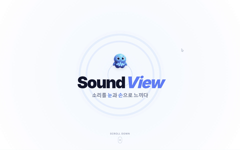
    </td>
    <td align="center">
      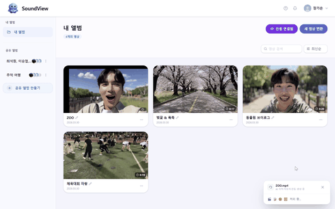
    </td>
  </tr>
</table>

### 햅틱 피드백 시청

영상의 소리 강도와 상황을 분석해 ESP32 기반 진동 디바이스로 실시간 햅틱 피드백을 전달합니다.

<table width="100%">
  <tr>
    <td width="50%" align="center"><b>진동 디바이스 연동</b></td>
    <td width="50%" align="center"><b>햅틱 적용 영상 조회</b></td>
  </tr>
  <tr>
    <td align="center">
      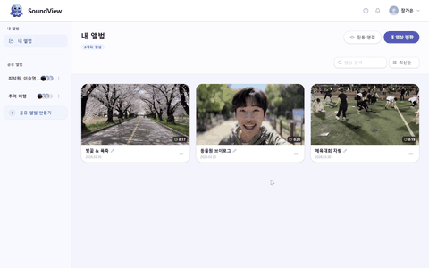
    </td>
    <td align="center">
      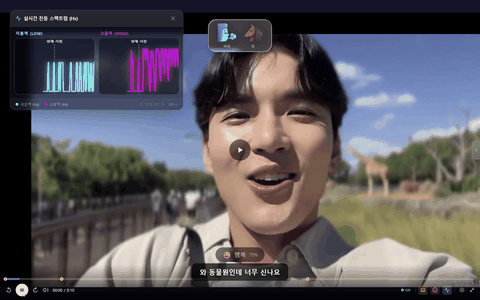
    </td>
  </tr>
</table>

 

<table width="100%">
  <tr>
    <td width="50%" align="center"><b>진동 미적용</b></td>
    <td width="50%" align="center"><b>진동 적용</b></td>
  </tr>
  <tr>
    <td align="center">
      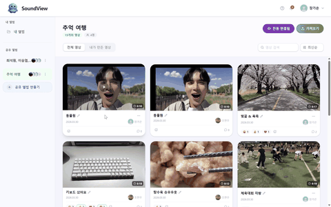
    </td>
    <td align="center">
      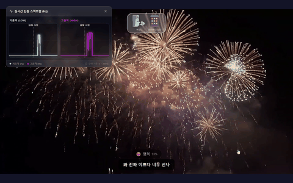
    </td>
  </tr>
</table>

### 상황별 진동 패턴

폭죽, 키보드, 동물원처럼 서로 다른 소리 환경을 구분해 상황에 맞는 진동 패턴을 제공합니다.

<table width="100%">
  <tr>
    <td width="33%" align="center"><b>폭죽</b></td>
    <td width="33%" align="center"><b>키보드</b></td>
    <td width="33%" align="center"><b>동물원</b></td>
  </tr>
  <tr>
    <td align="center">
      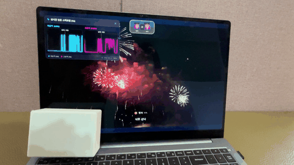
    </td>
    <td align="center">
      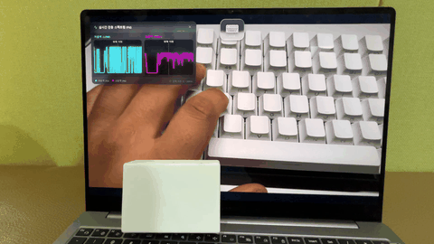
    </td>
    <td align="center">
      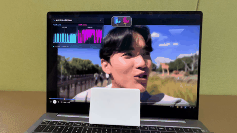
    </td>
  </tr>
</table>

### 앨범 및 공유

변환된 영상을 개인 앨범과 공유 앨범으로 관리하고, 함께 볼 수 있는 영상 컬렉션을 구성합니다.

<table width="100%">
  <tr>
    <td width="50%" align="center"><b>앨범 생성</b></td>
    <td width="50%" align="center"><b>공유 앨범 업로드</b></td>
  </tr>
  <tr>
    <td align="center">
      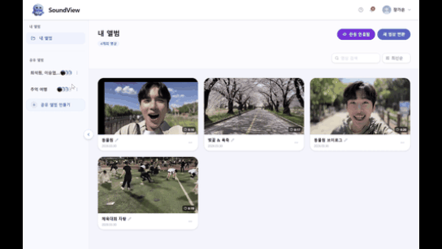
    </td>
    <td align="center">
      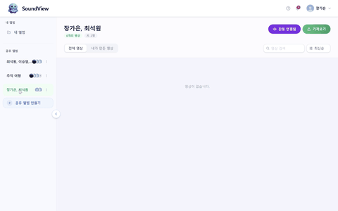
    </td>
  </tr>
</table>

### IoT 진동 디바이스

손목에 착용하거나 스마트폰에 부착할 수 있는 ESP32 기반 햅틱 디바이스를 제작해 웹 서비스와 WebSocket으로 연동했습니다.

<table width="100%">
  <tr>
    <td width="25%" align="center"><b>외부</b></td>
    <td width="25%" align="center"><b>기기 착용</b></td>
    <td width="25%" align="center"><b>뒷면</b></td>
    <td width="25%" align="center"><b>내부 구조</b></td>
  </tr>
  <tr>
    <td align="center">
      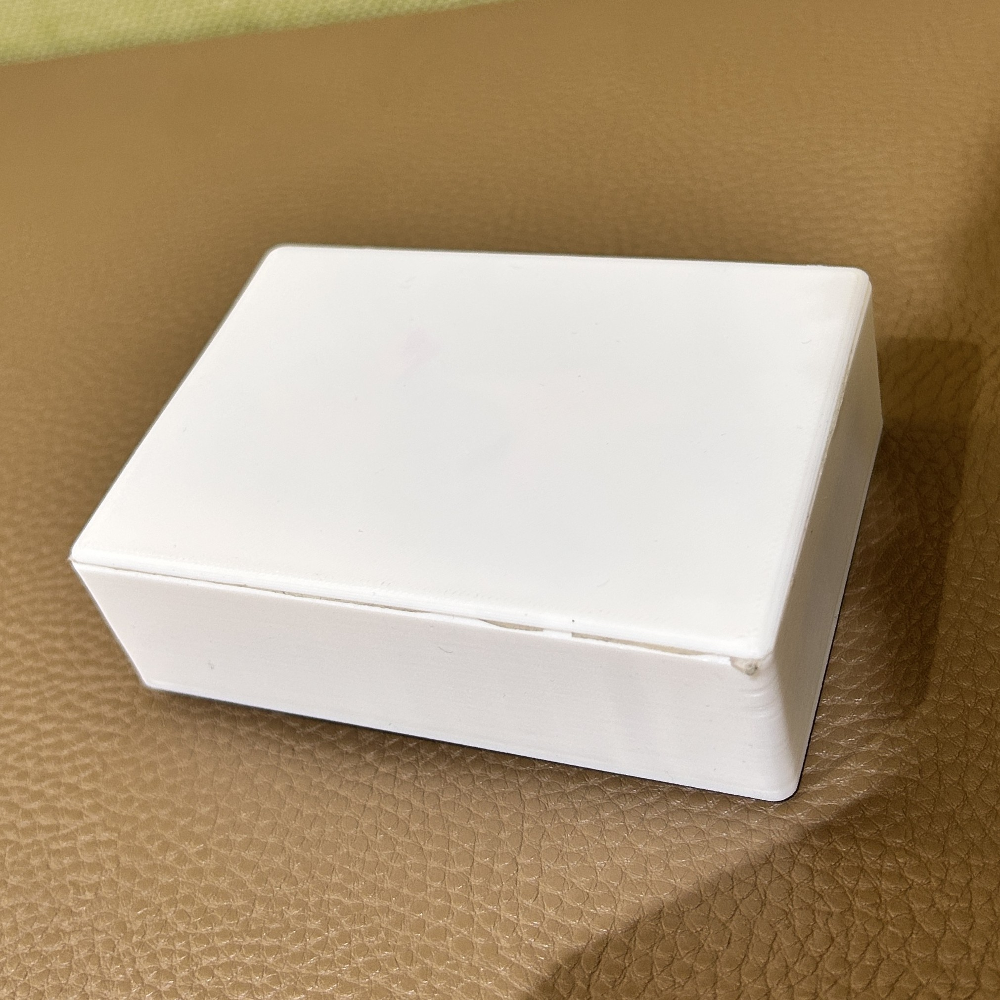
    </td>
    <td align="center">
      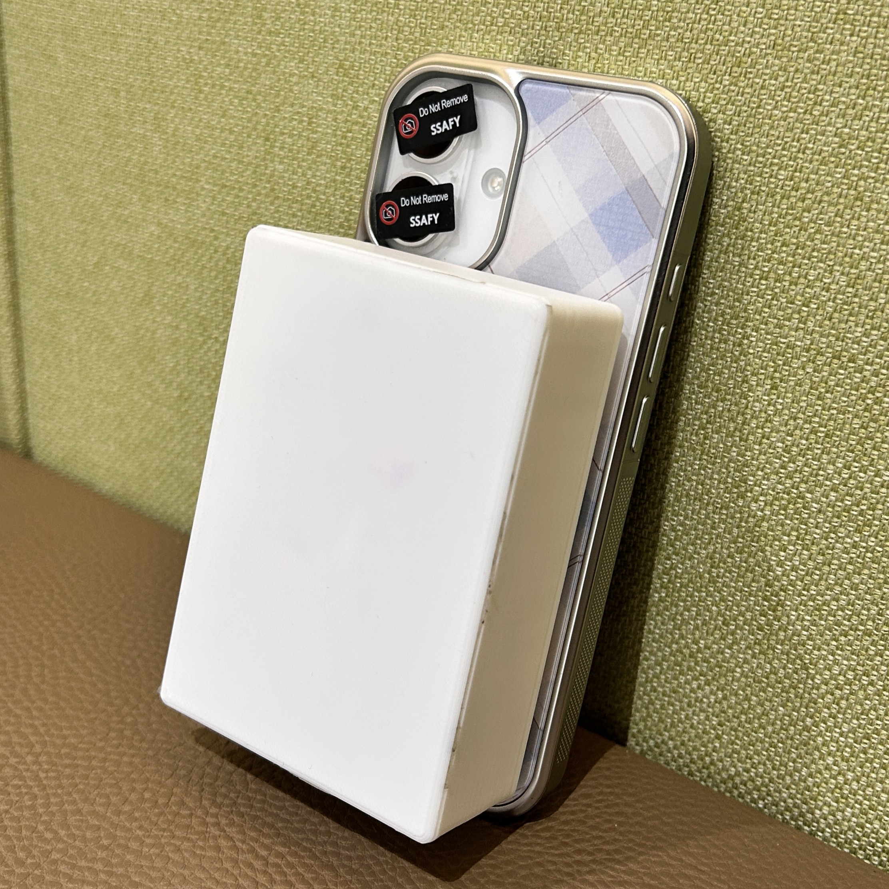
    </td>
    <td align="center">
      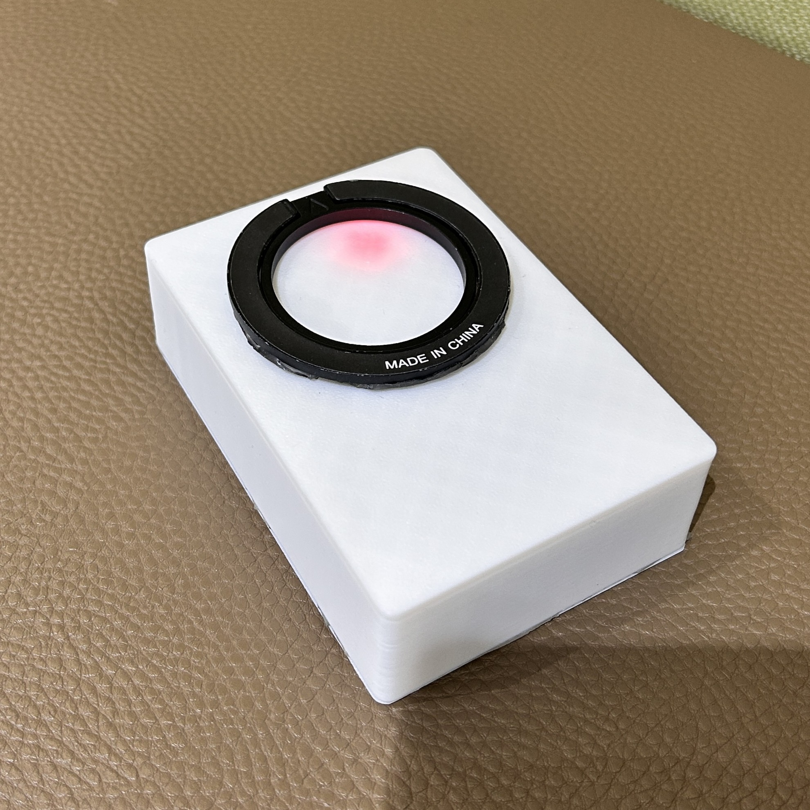
    </td>
    <td align="center">
      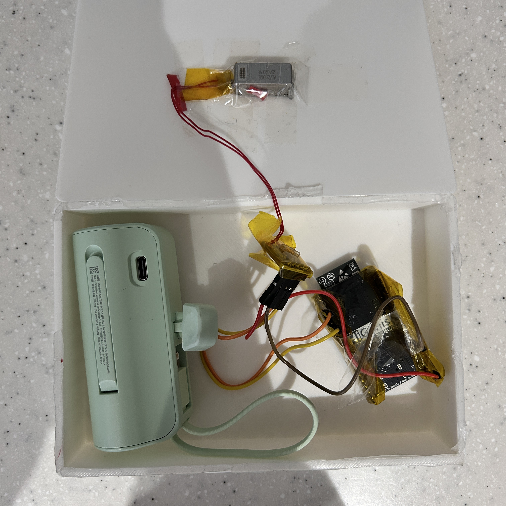
    </td>
  </tr>
</table>

---

## 🛠 기술 스택

### Frontend

  
  
  
  
  
  

| Category | Spec |
|:--:|:--|
| Language | TypeScript 5.9.3 |
| Runtime | Node.js 24.12.0 |
| Framework | React 19.2.0, React Router DOM 7.13.1 |
| 3D/Visual | Three.js 0.183.2, React Three Fiber 9.5.0, Drei 10.7.7 |
| Styling | Tailwind CSS 4.2.1 |
| Build Tool | Vite 7.3.1 |

### Backend

  
  
  
  
  
  

| Category | Spec |
|:--:|:--|
| Language | Java 17 |
| Framework | Spring Boot 3.3.5 |
| Core | Spring Security, OAuth2 Client, JWT, JPA, Validation |
| Messaging | RabbitMQ, Spring AMQP |
| Storage/CDN | AWS S3, CloudFront Signed URL |
| Database | MySQL, Redis |
| API Docs | Springdoc OpenAPI 2.5.0 |
| Build Tool | Gradle 9.3.1 |

### AI Integration

  
  
  
  
  

| Category | Spec |
|:--:|:--|
| API | FastAPI 0.128.8, Uvicorn |
| Async Pipeline | asyncio, aio-pika, aioboto3 |
| Speech/Subtitles | Faster-Whisper, WavLM, KLUE-BERT |
| Sound Event | ATST-F 기반 효과음 분류 |
| Audio Processing | Demucs, Librosa, Torchaudio, FFmpeg |
| ML Runtime | PyTorch 2.5.1 CUDA 12.1 |

### DevOps

  
  
  
  
  
  

| Category | Spec |
|:--:|:--|
| Container | Docker, Docker Compose |
| Gateway | Nginx |
| CI/CD | Jenkins |
| Database | MySQL 8, Redis |
| Message Broker | RabbitMQ 3 Management |
| Object Storage | AWS S3, MinIO |
| IoT | ESP32, WebSocket |

---

### Collaboration Tools

 

---

## 📄 Project Documents

SoundView의 상세 기획 및 설계 문서는 아래에서 확인하실 수 있습니다.

 

<table width="100%">
  <tr>
    <td width="30%" align="center"><b>포팅 매뉴얼</b></td>
    <td width="70%" align="left">
      <a href="./exec/PORTING.md">./exec/PORTING.md</a>
    </td>
  </tr>
  <tr>
    <td align="center"><b>AI 서버 문서</b></td>
    <td align="left">
      <a href="./ai/README.md">./ai/README.md</a>
    </td>
  </tr>
  <tr>
    <td align="center"><b>DB Dump</b></td>
    <td align="left">
      <a href="./exec/dump.sql">./exec/dump.sql</a>
    </td>
  </tr>
  <tr>
    <td align="center"><b>영상 편집 저장 API</b></td>
    <td align="left">
      <a href="./backend/VIDEO_EDIT_SAVE_API_SPEC.txt">./backend/VIDEO_EDIT_SAVE_API_SPEC.txt</a>
    </td>
  </tr>
</table>

  

---

<h2 align="center">🗃 Data Modeling</h2>

  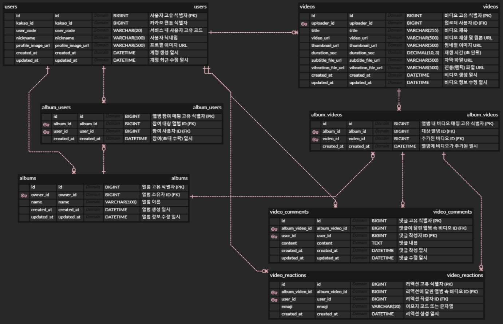

  Database ERD - 사용자, 영상, 앨범, 댓글, 리액션, 알림 도메인 구조

  

---

<h2 align="center">🏗 System Architecture</h2>

  

  영상 업로드부터 AI 분석, 결과 저장, CloudFront 조회, IoT 햅틱 스트리밍까지의 통합 아키텍처

 

---

<h2 align="center">🔄 AI 처리 파이프라인</h2>

  

  FastAPI AI Server - 영상 처리 및 AI 분석 파이프라인

  

---
