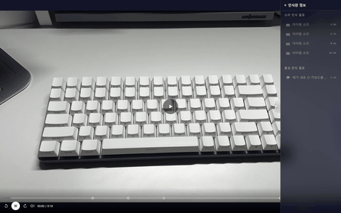

# 🎧 SoundView: 청각장애인을 위한 AI 기반 영상 자막 생성 및 햅틱 변환 서비스

SoundView는 AI를 활용해 영상 속 음성을 텍스트로 변환하고, 상황에 맞는 감정 분석 및 배경음(효과음) 분류를 수행하며, 이를 기반으로 **진동(Haptic) 피드백**까지 제공하는 비디오 플랫폼입니다. 기존의 단조로운 시청각 경험을 넘어, 소리를 온몸으로 느낄 수 있는 새로운 즐거움을 선사합니다.

---

## ✨ 주요 기능 (Key Features)

### 1. 📳 촉각으로 느끼는 오디오 (Haptic Feedback)
AI가 영상의 사운드 파형과 주파수를 세밀하게 분석하여, 상황에 맞는 정밀한 진동 패턴을 전용 IoT 기기에 전달합니다.

| 사운드뷰 랜더링 | 진동 디바이스 연동 |
| :---: | :---: |
|  |  |
| 서비스를 소개하는 랜더링 화면 | 원터치 IoT 기기 페어링 |

**다양한 환경에 최적화된 진동 (맞춤형 피드백)**
- 폭죽이 터지는 강렬한 타격감, 타건 시의 미세한 떨림, 동물원의 생동감 있는 소리 등을 각각 다르게 표현합니다.

| 🎇 폭죽 (강한 타격감) | ⌨️ 키보드 (미세한 떨림) |
| :---: | :---: |
|  |  |

> 💡 **비교하기**: 진동 연동 유무에 따른 조회 화면을 비교해보세요.
>
> | 🔕 진동 미적용 (일반 영상) | 📳 진동 적용 (Haptic On) |
> | :---: | :---: |
> |  |  |
> | 일반적인 영상/음향 시청 | 영상 속 상황에 맞춘 손끝의 진동 피드백 발생 |

**🎥 실제 기기 진동 피드백 시연**

| 🎇 폭죽 진동 | ⌨️ 키보드 진동 | 🦁 동물원 진동 |
| :---: | :---: | :---: |
|  |  |  |

---

### 🔧 진동 디바이스 (IoT Hardware)
손목에 착용하는 전용 IoT 기기로, ESP32 기반의 진동 모터를 내장하여 웹과 socket으로 연동됩니다. 추후 반응형 웹 서비스 제공을 위해 스마트폰에 부착해서 사용할 수 있도록 기기를 제작했습니다.

| 외부 | 기기 착용 | 뒷면 | 내부 구조 |
| :---: | :---: | :---: | :---: |
|  |  |  |  |

### 2. 🎬 자막, 배경음 편집
영상에서 사용할 자막, 배경음을 선택하는 기능을 제공합니다. 선택된 내용만 영상조회시 표시됩니다. 나만의 커스텀 영상을 만들어보세요.

  

### 3. 📁 나만의 앨범 & 소셜 공유 (Social & Media Management)
새롭게 만들어진 영상과 추출된 사운드뷰 결과물들을 테마별 앨범으로 관리하고, 가족 및 친구들과 함께 감상할 수 있는 공유 시스템을 지원합니다.

| 나만의 앨범 생성 | 친한 사람들과 공유 앨범 업로드 |
| :---: | :---: |
|  |  |

---