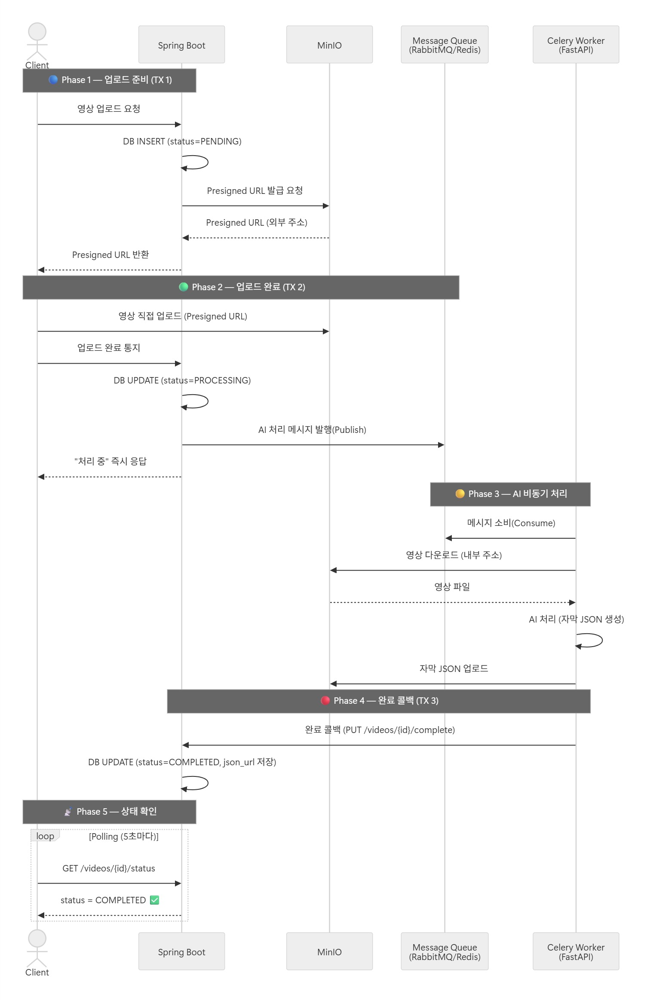

# AI 자막 생성 서비스 — 데이터 흐름 정리

## 기술 스택

| 역할 | 기술 |
| --- | --- |
| API 서버 (컨트롤 타워) | Spring Boot |
| 파일 스토리지 | MinIO (S3 호환) |
| 메시지 큐 | RabbitMQ 또는 Redis |
| AI 워커 | Celery + FastAPI |
| 상태 추적 | DB `status` 필드 (Enum) |

---

## 데이터 흐름 (단계별)

### 🔵 Phase 1 — 업로드 준비 (트랜잭션 1)

1. **Client → Spring Boot**: 영상 업로드 요청
2. **Spring Boot**: DB에 `Video` 레코드 생성, `status = PENDING`
3. **Spring Boot → MinIO**: Presigned URL 발급 (클라이언트용 **외부 주소** 기준)
4. **Spring Boot → Client**: Presigned URL 반환

### 🟢 Phase 2 — 업로드 완료 통지 (트랜잭션 2)

1. **Client → MinIO**: Presigned URL을 통해 영상 직접 업로드
2. **Client → Spring Boot**: 업로드 완료 통지
3. **Spring Boot**: DB 상태 → `PROCESSING`
4. **Spring Boot → Message Queue**: AI 처리 작업 메시지 발행(Publish)
5. **Spring Boot → Client**: `"처리 중"` 즉시 응답

<aside>

> 💡 **NOTE**
Spring Boot는 큐에 메시지를 넣고 바로 응답합니다. FastAPI 처리 완료를 기다리지 않습니다.
> 
</aside>

### 🟡 Phase 3 — AI 비동기 처리

1. **Celery Worker (FastAPI)**: 큐에서 메시지 소비(Consume)
2. **Celery → MinIO**: **내부 주소**로 영상 다운로드 (서버 간 통신 최적화)
3. **FastAPI**: AI 모델로 자막 처리 → JSON 파일 생성
4. **FastAPI → MinIO**: 자막 JSON 파일 업로드

### 🔴 Phase 4 — 완료 콜백 (트랜잭션 3)

1. **FastAPI → Spring Boot**: 완료 콜백 (`PUT /videos/{id}/complete`)
2. **Spring Boot**: DB 상태 → `COMPLETED`, 결과 JSON URL 저장

### 📡 Phase 5 — 클라이언트 상태 확인

1. **Client**: Polling (`GET /videos/{id}/status`) 으로 상태 확인
    - 또는 SSE/WebSocket으로 실시간 알림 수신 (고도화 단계 권장)

---

## 트랜잭션 분리 전략

- **트랜잭션 1:** INSERT video → status = PENDING (수ms)
- **트랜잭션 2:** UPDATE video → status = PROCESSING (수ms) + 큐 publish
- **트랜잭션 3:** UPDATE video → status = COMPLETED (수ms) + JSON URL 저장

> ⚡ **IMPORTANT**
AI 처리 시간(수십 초~수 분)은 어떤 트랜잭션에도 포함되지 않습니다.
DB 커넥션은 항상 수십 ms 수준으로만 점유됩니다.
> 

---

## MinIO 주소 분리 전략

| 상황 | 사용 주소 | 예시 |
| --- | --- | --- |
| Presigned URL 발급 (클라이언트용) | **외부 주소** | `https://storage.mydomain.com` |
| FastAPI ↔ MinIO 통신 (서버 간) | **내부 주소** | `http://minio:9000` |

### 동시 업로드 처리 흐름 (100명 동시 요청 시)

1. **사용자 100명 동시 요청**
2. **Spring Boot:** 100개 요청 즉시 수용 → 큐에 100개 메시지 적재 → 응답 완료
3. **Message Queue:** 100개 메시지 안전하게 보관 (댐 역할)
4. **Celery Workers:** GPU/CPU 용량에 맞춰 순차 or 병렬 처리 (예: Worker 4개 → 동시에 4개씩 처리)