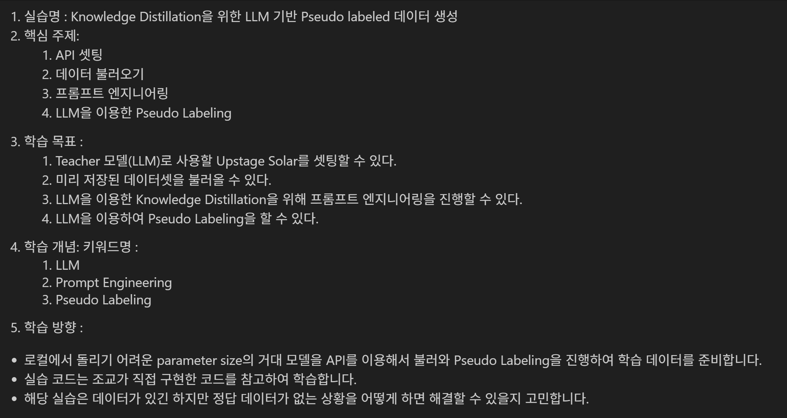

---
# 0. Knowledge Distillation(지식 증류, KD) 방법론

우리가 지금 실습하려는 **Pseudo Labeling**은 KD의 가장 기본적인 형태 중 하나입니다. 하지만 학계와 현업에서는 Teacher 모델의 '어떤 지식'을 '어떻게' 빼내느냐에 따라 다양한 방법론이 존재합니다. 이를 크게 전달하는 지식의 형태(Knowledge Type)에 따라 세 가지로 분류하고, 최근 **LLM 시대의 방법론**을 별도로 짚어보겠습니다.

### **1. Response-Based Knowledge (결과 중심 증류)**

가장 전통적이고(Geoffrey Hinton, 2015), 지금도 가장 많이 쓰이는 방식입니다. Teacher의 **최종 출력값(Last Layer Output)**을 Student가 모방하게 합니다.

* **Soft Targets (Logits Matching):**
  * **개념:** 단순히 정답(Hard Label, [0, 1, 0])만 배우는 게 아니라, 오답이지만 가능성 있는 확률(Soft Label, [0.05, 0.9, 0.05])까지 배웁니다.
  * **핵심:** `Temperature (T)` 파라미터를 사용하여 확률 분포를 부드럽게(Softening) 만듭니다. 이를 통해 Student는 "이 사진은 강아지지만, 고양이와도 꽤 비슷하구나"라는 **Dark Knowledge(숨겨진 지식)**를 학습합니다.

* **Hard Targets (Pseudo Labeling):**
  * **개념:** Teacher가 뱉은 가장 높은 확률의 클래스를 정답(Ground Truth)으로 간주하고 학습합니다.
  * **특징:** 우리가 진행할 **이번 실습**이 바로 여기에 해당합니다. Teacher(API)의 Logit(확률값)에 접근할 수 없는 **Black-box** 환경에서 가장 유용한 방법입니다.

### **2. Feature-Based Knowledge (중간 과정 증류)**

Teacher 모델이 깊어질수록 최종 출력값보다는 **중간 레이어(Intermediate Layers)**에 더 풍부한 특징(Feature) 정보가 담겨 있다는 점에 착안한 방법입니다.

* **Hint Learning / Feature Map Matching:**
  * **개념:** Teacher의 중간 레이어에서 나오는 Feature Map과 Student의 중간 레이어 Feature Map이 유사해지도록 손실 함수(Loss Function)를 설계합니다.
  * **엔지니어링 이슈:** Teacher와 Student의 레이어 크기(Dimension)가 다르기 때문에, 이를 맞춰주기 위한 추가적인 **Regressor(변환 레이어)**가 필요합니다.

* **Attention Transfer:**
  * **개념:** Teacher가 입력 데이터의 '어떤 부분'을 중요하게 보고 있는지(Attention Map)를 Student에게 전수합니다. "이 문제를 풀 때 여기를 봐야 해"라고 시선을 교정해 주는 것과 같습니다.

### **3. Relation-Based Knowledge (관계 중심 증류)**

데이터 하나하나의 출력값을 모방하는 것을 넘어, 데이터들 사이의 **관계(Relation)**를 학습합니다.

* **Distance-wise Distillation:**
  * **개념:** Teacher 모델 공간에서 데이터 A와 B가 가깝고 C가 멀다면, Student 모델 공간에서도 A-B는 가깝고 C는 멀어야 합니다. 이러한 기하학적 구조를 보존합니다.

* **Graph-based Distillation:**
  * **개념:** 데이터를 그래프의 노드로 보고, Teacher가 형성한 그래프 구조(Graph Structure)를 Student가 모방하게 합니다.

### **4. LLM 시대의 KD 방법론 (Generative KD)**

최근 LLM 트렌드에서는 위 방법론들이 조금 다르게 적용됩니다. 특히 API만 열려있는 거대 모델(GPT-4, Solar 등)을 Teacher로 쓸 때는 **Black-box KD**가 주를 이룹니다.

* **CoT (Chain-of-Thought) Distillation:**
  * **개념:** 단순히 "답: A"를 배우는 게 아니라, Teacher가 생성한 **"추론 과정(Reasoning)"** 텍스트 자체를 학습 데이터에 포함시킵니다.
  * **효과:** Student 모델(소형 LLM)의 논리적 사고력을 비약적으로 상승시킵니다. 우리 실습의 프롬프트 엔지니어링 단계에서 `reason` 필드를 추가하는 것이 바로 이 효과를 노린 것입니다.

* **Instruction Tuning Distillation:**
  * **개념:** Teacher 모델을 이용해 다양한 지시문(Instruction)과 그에 대한 수행 결과 쌍을 대량 생성하여 Student를 튜닝합니다. (예: Stanford Alpaca)

* **In-Context Learning Distillation:**
  * **개념:** Teacher에게 Few-shot 예시를 주어 수행 능력을 끌어올린 뒤, 그 결과를 Student의 학습 데이터로 씁니다. 즉, Teacher의 '맥락 이해 능력'을 데이터 형태로 증류하는 것입니다.

#### 정리
1. 최근 LLM의 등장으로 인해서 현업에서는 과거의 모델 레이어를 건드리는 방법론에서 GPT 등의 거대 모델 API를 이용하여 합성 데이터를 만들거나 기존에 있는 데이터에 정답 라벨링을 모델로 만드는 방법론으로 전환하고 있습니다. 그 이유는 다음과 같습니다.
   1. 현업에서는 정제되지 않은 데이터는 매우 많습니다. 그러나 상대적으로 비싼 데이터 라벨링 비용으로 모든 데이터를 라벨링하지 못합니다.
   2. 레이어를 건드리는 효과 대비 고퀄리티 학습 데이터를 만드는 방법론이 좀더 효과적입니다. 특히, LLM으로 넘어오게 되면서 고퀄리티 학습 데이터의 중요성은 더더욱 커지고 있습니다.
2. Teacher 모델이 생성한 데이터를 학습함으로써 Teacher 모델의 정답을 Student 모델이 그대로 학습하게 되어 정답을 "전수"받는 효과를 얻습니다.

---

### 3.1. 프롬프트 엔지니어링

<blockquote>
<b>🧠 프롬프트 엔지니어링(Prompt Engineering)이란?</b> 
AI 모델에게 원하는 답을 정확하고 효율적으로 이끌어내기 위해 입력(프롬프트)을 설계·최적화하는 기술을 말합니다.
</blockquote>

1. 프롬프트 엔지니어링은 모델의 성능을 크게 좌우합니다.
	- AI 모델은 질문(프롬프트)에 따라 같은 데이터라도 완전히 다른 답을 내놓습니다.
		- 잘못된 프롬프트 → 모호하거나 엉뚱한 답변
		- 잘 설계된 프롬프트 → 정확하고 원하는 형식의 답변
	- 프롬프트 엔지니어링은 AI를 내 마음대로 컨트롤하는 리모컨과 같습니다.

2. 프롬프트의 기본 구조
하나의 프롬프트는 보통 다음 요소들로 구성됩니다.
	1. 역할(Role) 설정 → AI의 “정체성”과 “관점”을 지정합니다.
		- 예: “당신은 10년 경력의 여행 가이드입니다.”
	2. 목표(Task) 명확화 → 무엇을 해야 하는지 구체적으로 지시합니다.
		- 예: “서울에서 하루 동안 즐길 수 있는 코스를 추천해주세요.”
	3. 조건(Constraints) 부여 → 답변 길이, 형식, 언어, 스타일 등 제한사항을 명시합니다.
		- 예: “표 형식으로 3개의 추천 코스를 제시하고, 각 코스에 사진 링크를 포함하세요.”
	4.	예시(Examples) 제공 (Few-shot Prompting) → 원하는 답변 패턴을 보여주면 AI가 비슷하게 답변합니다.
		- 예: “예시: 코스 이름 - 설명 - 추천 이유”

3. 좋은 프롬프트 작성 원칙
	- 명확성 → 애매한 단어 대신 구체적인 지시
	- 맥락 제공 → 필요한 배경정보 포함
	- 출력 형식 지정 → 표, 목록, JSON 등
	- 예시 제시 → 원하는 결과물의 예시를 보여줌
	- 점진적 요청 → 복잡한 문제는 단계별로 쪼개서 요청
  
참고 [링크](https://www.notion.so/ssunbell/2341806f5bc1803491c3cea9d7a96933?source=copy_link)